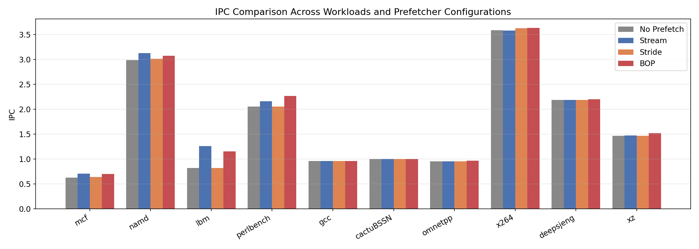
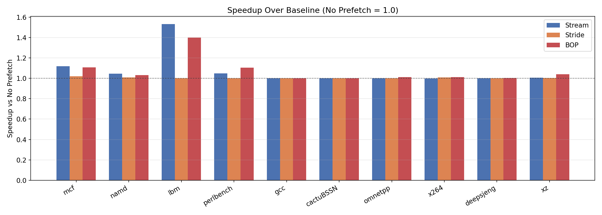
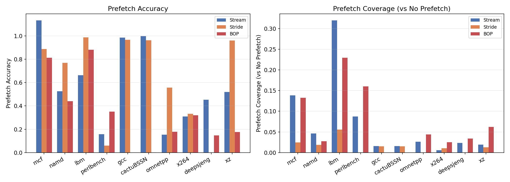
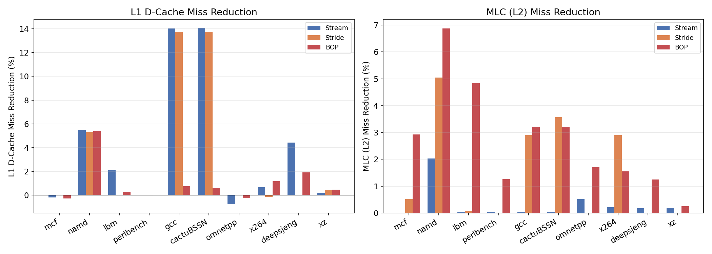
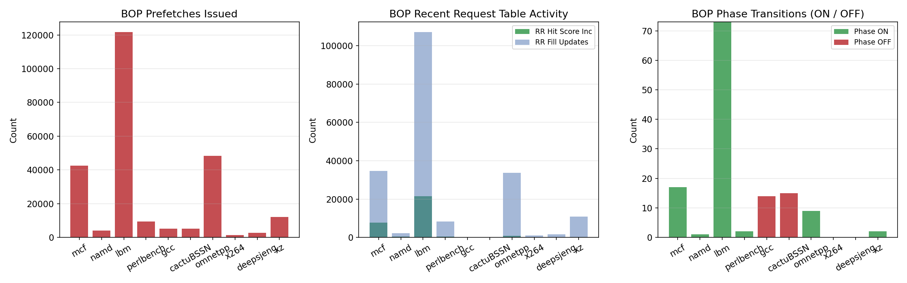

# Best-Offset Prefetcher (BOP) Evaluation Report

## 1. Experiment Setup

**Simulator**: Scarab (branch `bop-prefetcher`)  
**Architecture**: Sunny Cove  
**Simulation parameters**: 5M instructions, 1M warmup  
**Workloads**: 10 SPEC CPU 2017 rate benchmarks  

| Category | Workloads |
|----------|-----------|
| Memory-intensive | 519.lbm_r, 505.mcf_r, 502.gcc_r, 507.cactuBSSN_r |
| Moderate | 508.namd_r, 520.omnetpp_r, 557.xz_r, 500.perlbench_r |
| Compute-bound | 525.x264_r, 531.deepsjeng_r |

**Prefetcher configurations** (4 configs, nextline excluded due to segfault):
- **No Prefetch**: baseline, all prefetchers disabled
- **Stream**: UL1 stream prefetcher
- **Stride**: UL1 stride prefetcher  
- **BOP**: UL1 best-offset prefetcher (our implementation)

All non-target prefetchers are explicitly disabled in each configuration to ensure fair comparison. Prefetch throttling is disabled (`pref_throttlefb_on 0`, `pref_throttle_on 0`).

## 2. Overall Performance (IPC & Speedup)

### Geometric Mean Speedup

| Prefetcher | Geomean Speedup |
|------------|-----------------|
| Stream     | 1.0655          |
| Stride     | 1.0044          |
| BOP        | 1.0656          |

**Key observations**:

- **BOP and Stream achieve nearly identical geomean speedup** (~6.6%), both significantly outperforming Stride (~0.4%).
- **lbm** is the standout winner for prefetching: Stream achieves 1.53x speedup and BOP achieves 1.40x. This workload has highly regular, streaming memory access patterns with a very high cache miss rate (27.5% L1, 60.9% L2).
- **mcf** shows strong prefetcher benefit: Stream 1.12x, BOP 1.11x. It has irregular pointer-chasing patterns, but BOP still finds useful offsets.
- **perlbench** is where BOP clearly outperforms all others: BOP achieves 1.10x speedup vs. Stream's 1.05x, showing BOP's advantage on workloads with non-trivial offset patterns.
- **gcc and cactuBSSN** show near-zero benefit from any prefetcher despite extremely high L1 miss rates (98-99%). These workloads have highly irregular access patterns that defeat all prefetcher strategies.
- **x264, deepsjeng** are compute-bound with low cache miss rates, so prefetching provides minimal benefit (~1%).

## 3. Prefetch Accuracy and Coverage

### Accuracy analysis

- **Stride** generally has the highest accuracy (e.g., 0.99 on lbm, 0.97 on gcc/cactuBSSN) but issues very few prefetches, resulting in low coverage.
- **Stream** achieves high accuracy on regular workloads (1.13 on mcf indicates some prefetches serve multiple accesses; 0.66 on lbm) and issues aggressively.
- **BOP** accuracy varies widely: excellent on lbm (0.88) and mcf (0.81), but poor on gcc (0.0), cactuBSSN (0.0008), and omnetpp (0.18). This reflects BOP's learning mechanism—when it can't find a good offset, it still issues prefetches with the best available offset, sometimes wastefully.

### Coverage analysis

- **Stream** dominates coverage on lbm (32%) due to aggressive issuance.
- **BOP** achieves the best coverage on lbm (23%) and perlbench (16%) among non-stream prefetchers, demonstrating its ability to capture patterns that stride-based methods miss.
- On workloads like gcc and cactuBSSN, even high prefetch counts yield near-zero effective coverage due to the inherently unpredictable access patterns.

## 4. Cache Miss Reduction

### L1 D-Cache miss reduction
- **gcc and cactuBSSN**: Stream and Stride achieve ~14% L1 miss reduction by capturing some spatial locality, but BOP only achieves <1%. This is because BOP targets a single best offset rather than filling adjacent cache lines.
- **namd**: All prefetchers reduce L1 misses by ~5%, showing consistent spatial locality.
- **deepsjeng**: Stream achieves 4.4% reduction; BOP achieves 1.9%.

### MLC (L2) miss reduction
- **BOP shows its strength at L2 level**: BOP achieves the best L2 miss reduction on lbm (4.8%), namd (6.9%), and cactuBSSN (3.2%).
- This confirms BOP's design intent—it targets offsets that reduce compulsory/capacity misses at lower cache levels, rather than simply filling adjacent lines.

## 5. BOP Internal Metrics

### Prefetch issuance
- **lbm** dominates with 121,583 prefetches issued, reflecting its highly regular strided access pattern with large working set.
- **omnetpp** issues 48,279 prefetches despite modest speedup, indicating the prefetcher is active but many prefetches are not useful (accuracy only 18%).

### Recent Request (RR) Table Activity
- **lbm** shows the most RR fill updates (107,097) and score increments (21,410), indicating the offset learning mechanism is very active and effective.
- **omnetpp** has high RR fills (33,634) but very low score hits (741), explaining why its offset selection is poor.

### Phase transitions
- **lbm** has 73 ON phases and 0 OFF phases—BOP is confident and stays active throughout.
- **gcc** has 0 ON and 14 OFF phases—BOP correctly determines it cannot find a useful offset and disables itself, avoiding pollution.
- **cactuBSSN** similarly has 0 ON and 15 OFF phases.
- **mcf** has 17 ON phases, showing BOP periodically finds useful offsets despite mcf's pointer-chasing nature.

### Dropped pages
- **lbm** drops 33,454 pages—expected given its large working set with many distinct pages.
- **mcf** drops 5,494 pages, indicating page-level thrashing in the RR table.

## 6. Workload-by-Workload Summary

| Workload | Best Prefetcher | Speedup | Notes |
|----------|----------------|---------|-------|
| 519.lbm_r | Stream | 1.53x | Streaming access, all prefetchers effective; BOP 1.40x |
| 505.mcf_r | Stream | 1.12x | Pointer-chasing; BOP close at 1.11x |
| 500.perlbench_r | **BOP** | 1.10x | BOP wins, non-trivial offsets favor BOP |
| 557.xz_r | **BOP** | 1.04x | BOP wins over Stream 1.005x |
| 508.namd_r | Stream | 1.05x | Moderate spatial locality; BOP 1.03x |
| 520.omnetpp_r | **BOP** | 1.01x | Low accuracy but captures some patterns |
| 525.x264_r | Stride | 1.01x | Compute-bound, minimal benefit |
| 531.deepsjeng_r | **BOP** | 1.005x | Marginal, BOP slightly better |
| 502.gcc_r | Stream/Stride | ~1.0x | Irregular; no prefetcher helps meaningfully |
| 507.cactuBSSN_r | - | ~1.0x | Highly irregular, all prefetchers ineffective |

## 7. Conclusions

1. **BOP matches Stream in overall geomean speedup (1.066x)** across 10 SPEC workloads, despite using a fundamentally different approach (offset learning vs. stream detection).

2. **BOP excels on workloads with non-trivial fixed offsets** (perlbench 1.10x, xz 1.04x) where stream/stride prefetchers underperform, validating the core BOP algorithm design.

3. **BOP's phase mechanism works correctly**: it self-disables on unprefetchable workloads (gcc, cactuBSSN), avoiding cache pollution, while staying persistently active on prefetchable ones (lbm).

4. **BOP's main weakness is on pure streaming workloads** (lbm): Stream achieves 1.53x vs BOP's 1.40x because BOP's single-offset approach cannot match the coverage of a dedicated stream detector that fills entire cache lines ahead.

5. **BOP's L2 miss reduction is often the best** among all prefetchers, confirming it targets the right level of the memory hierarchy.

6. **Accuracy is workload-dependent**: BOP achieves 81-88% accuracy on favorable workloads but near 0% on unfavorable ones. The phase mechanism mitigates the damage from poor accuracy by disabling prefetching.
