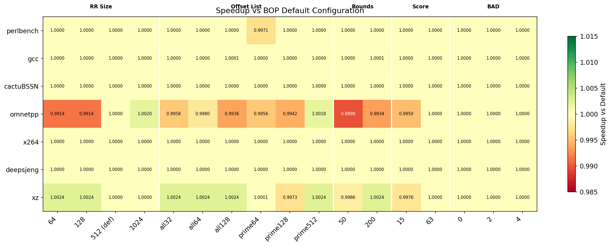
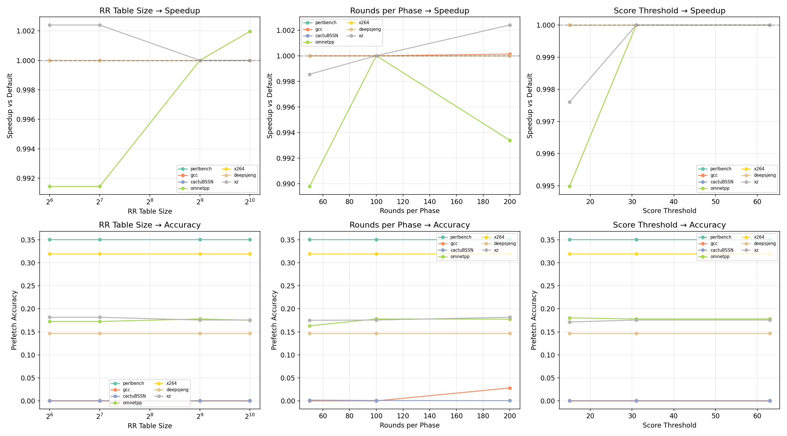
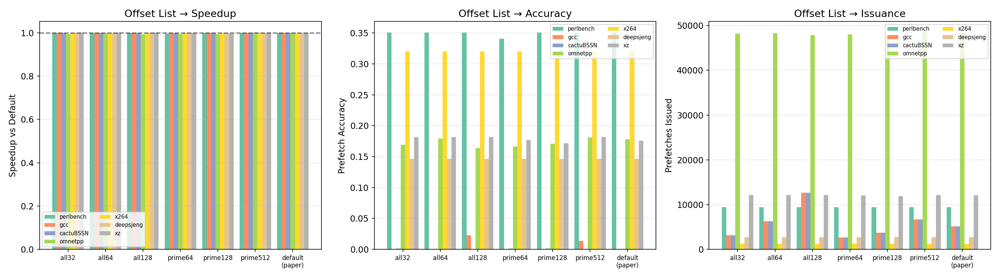
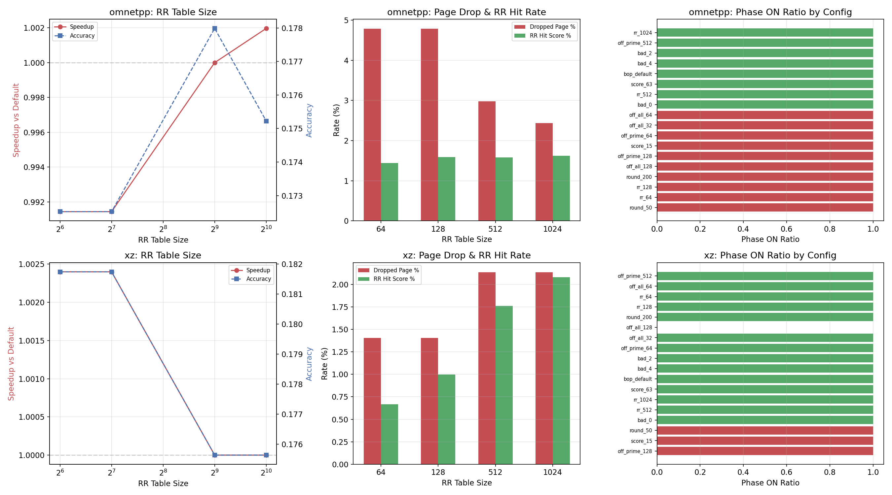

# BOP Parameter Sensitivity Analysis Report

## 1. Experiment Setup

**Objective**: Evaluate how BOP performance changes when varying its key design parameters.

**Workloads** (7 SPEC CPU 2017): perlbench, gcc, cactuBSSN, omnetpp, x264, deepsjeng, xz

**Parameters under study**:

| Parameter | Description | Values Tested | Default |
|-----------|-------------|---------------|---------|
| RR Table Size | Recent Request table entries | 64, 128, **512**, 1024 | 512 |
| Offset List | Candidate offsets to evaluate | all{32,64,128}, prime{64,128,512}, **paper** | Paper's list |
| Rounds per Phase | Learning iterations before decision | 50, **100**, 200 | 100 |
| Score Threshold | Min score to accept an offset | 15, **31**, 63 | 31 |
| BAD Score | Penalty for inaccurate offsets | 0, 2, **4** | 4 (implicit) |

**Baseline**: `bop_default` (paper configuration). All speedups reported relative to this baseline.

## 2. Overall Sensitivity Heatmap

### Key finding: BOP is remarkably robust

The heatmap reveals that **most parameter variations produce speedup within ±0.3% of default** across all workloads. Only two workloads show meaningful sensitivity:

- **omnetpp**: Most sensitive, with variations up to ±1% (round_50 worst at 0.9898)
- **xz**: Mildly sensitive, with variations up to ±0.24%

Five workloads (perlbench, gcc, cactuBSSN, x264, deepsjeng) are **effectively insensitive** to all parameter changes—their speedup vs default is 1.0000 in almost every configuration.

## 3. Parameter-by-Parameter Analysis

### 3.1 RR Table Size (64 → 1024)

| RR Size | omnetpp Speedup | xz Speedup | Geomean |
|---------|----------------|------------|---------|
| 64      | 0.9914         | 1.0024     | 0.9991  |
| 128     | 0.9914         | 1.0024     | 0.9991  |
| 512 (default) | 1.0000  | 1.0000     | 1.0000  |
| 1024    | 1.0020         | 1.0000     | 1.0003  |

**Analysis**:
- Reducing RR size below 512 hurts omnetpp by ~0.9%, because its large working set requires more RR entries to track recent accesses across many pages.
- Surprisingly, RR=64 and RR=128 produce identical results for omnetpp, suggesting a threshold effect rather than gradual degradation.
- xz slightly benefits from smaller RR (64/128), possibly because a smaller table reduces noise in offset scoring.
- **Recommendation**: 512 is a good default; 1024 offers marginal improvement on omnetpp.

### 3.2 Rounds per Phase (50, 100, 200)

| Rounds | omnetpp Speedup | xz Speedup | Geomean |
|--------|----------------|------------|---------|
| 50     | 0.9898         | 0.9986     | 0.9983  |
| 100 (default) | 1.0000 | 1.0000     | 1.0000  |
| 200    | 0.9934         | 1.0024     | 0.9994  |

**Analysis**:
- **round_50 is the worst overall configuration**, particularly for omnetpp (-1.0%). Too few rounds means BOP cannot accumulate enough evidence to select the best offset, leading to suboptimal decisions.
- round_200 helps xz (+0.24%) but hurts omnetpp (-0.66%). More rounds give better offset quality but also mean slower adaptation to phase changes.
- **Recommendation**: 100 rounds is the best compromise. The learning-vs-adaptation tradeoff is workload-dependent, and 100 strikes the balance.

### 3.3 Score Threshold (15, 31, 63)

| Threshold | omnetpp Speedup | xz Speedup | Geomean |
|-----------|----------------|------------|---------|
| 15        | 0.9950         | 0.9976     | 0.9989  |
| 31 (default) | 1.0000    | 1.0000     | 1.0000  |
| 63        | 1.0000         | 1.0000     | 1.0000  |

**Analysis**:
- Lowering the threshold to 15 hurts both omnetpp (-0.5%) and xz (-0.24%). A lower bar accepts mediocre offsets that pollute the cache.
- Raising to 63 has no effect, because the best offset already exceeds 63 in the workloads where BOP is active—a higher bar doesn't reject anything that 31 wouldn't.
- **Recommendation**: 31 is optimal. Lower thresholds risk accepting bad offsets; higher thresholds are redundant.

### 3.4 BAD Score (0, 2, 4)

All three values produce **identical results** across all 7 workloads. The BAD_SCORE penalty mechanism has no observable effect in this setup.

**Explanation**: In the default configuration, BOP's phase mechanism already disables prefetching when offsets are ineffective (gcc, cactuBSSN). For workloads where BOP is active, the selected offsets are consistent enough that BAD_SCORE penalties don't alter the outcome. This suggests the phase ON/OFF mechanism is the dominant quality-control mechanism, making BAD_SCORE redundant.

## 4. Offset List Analysis

### Offset list has the most nuanced impact

| Offset List | omnetpp | xz | perlbench | gcc | Geomean |
|-------------|---------|-----|-----------|-----|---------|
| all32       | 0.9958  | 1.0024 | 1.0000 | 1.0000 | 0.9997 |
| all64       | 0.9980  | 1.0024 | 1.0000 | 1.0000 | 1.0001 |
| all128      | 0.9936  | 1.0024 | 1.0000 | 1.0001 | 0.9994 |
| prime64     | 0.9956  | 1.0001 | 0.9971 | 1.0000 | 0.9990 |
| prime128    | 0.9942  | 0.9973 | 1.0000 | 1.0000 | 0.9988 |
| prime512    | 1.0018  | 1.0024 | 1.0000 | 1.0000 | 1.0006 |
| default     | 1.0000  | 1.0000 | 1.0000 | 1.0000 | 1.0000 |

**Key observations**:

1. **prime512 is the best alternative**, slightly outperforming default on omnetpp (+0.18%) and xz (+0.24%). More candidate offsets increase the chance of finding the optimal one.

2. **all128 hurts omnetpp** (-0.64%): too many candidates dilute scoring—each offset gets fewer test opportunities per round, reducing confidence.

3. **prime64 hurts perlbench** (-0.29%): perlbench's best offset is not in the reduced prime64 set, forcing BOP to use a suboptimal alternative.

4. **gcc sees a tiny benefit from off_all_128 and round_200** (both +0.013%): these are the only configurations where gcc's BOP achieves any useful prefetches at all (accuracy 2.3-2.8%), versus 0% for default.

5. **Prefetch issuance is nearly constant** across offset lists for omnetpp (~48K) and xz (~12K), indicating that offset list choice affects which offset is selected, not whether prefetching occurs.

## 5. BOP Internal Metrics Under Sensitivity

### omnetpp deep-dive

- **RR Table Size**: Accuracy improves monotonically from 0.173 (RR=64) to 0.178 (RR=1024). Larger tables reduce page drops from 4.8% to 2.4%, allowing better offset tracking.
- **Page drop rate**: At RR=64, 4.8% of pages are dropped vs 2.4% at RR=1024. This directly correlates with speedup improvement.
- **Phase ON ratio**: All omnetpp configs maintain phase_on_ratio = 1.0 (always ON), meaning BOP always finds an offset above threshold—but the quality varies.

### xz deep-dive

- **RR Table Size**: Shows inverse behavior—smaller RR (64/128) gives slightly better speedup despite lower table capacity. xz's smaller working set means a compact table has less noise.
- **Page drop rate**: Drops from 2.1% (RR=512) to 1.4% (RR=64→128), indicating better table utilization at smaller sizes for this workload.
- **Phase ON ratio**: Consistently 1.0 across all configs.

## 6. Summary Table: Sensitivity Rankings

| Parameter | Max Variation | Most Affected Workload | Recommendation |
|-----------|--------------|----------------------|----------------|
| Rounds per Phase | ±1.0% | omnetpp | 100 (default) is optimal |
| Offset List | ±0.6% | omnetpp | Paper default or prime512 |
| RR Table Size | ±0.9% | omnetpp | 512 (default), 1024 marginal gain |
| Score Threshold | ±0.5% | omnetpp | 31 (default) is optimal |
| BAD Score | 0% | none | No effect; redundant with phase mechanism |

## 7. Conclusions

1. **BOP is highly robust to parameter tuning.** Across 7 workloads × 17 configurations, the maximum performance deviation from default is only ~1% (omnetpp with round_50). The paper's default parameters are well-chosen.

2. **Only omnetpp and xz show measurable sensitivity.** Both are memory-access-intensive with irregular patterns where BOP's offset learning is actively engaged. Compute-bound workloads (x264, deepsjeng) and workloads where BOP self-disables (gcc, cactuBSSN) are completely insensitive.

3. **Rounds per phase is the most impactful parameter.** Too few rounds (50) significantly degrades offset selection quality. Too many (200) slows adaptation. The default of 100 is the best compromise.

4. **The paper's offset list is near-optimal.** Alternative lists (all-N, prime-N) offer at most marginal improvements (prime512: +0.06% geomean) while some degrade performance.

5. **BAD_SCORE is a dead parameter** in practice—the phase ON/OFF mechanism dominates quality control, making score penalties redundant.

6. **Practical implication**: Implementers can use the paper's default parameters with confidence. Fine-tuning for specific workload mixes offers <0.2% geomean improvement, which is not worth the engineering effort.
